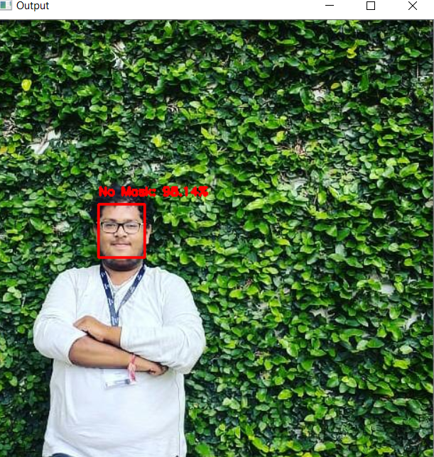
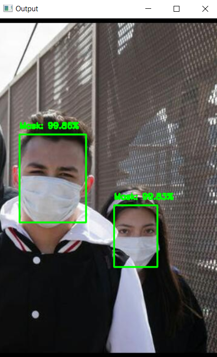

## FACE MASK DETECTION

It is not easy to detect faces with masks on it and still there will be need of two things
1. Face Detection
2. Checking whether there is mask on face or not

### Tech Stack

* OpenCV
* Tensorflow/Keras
* Deep learning

### How to run in cmd

` face_mask_detect.py --image image/bharath.jpg `

### Output 1 : without mask

### Output 2 : with mask

